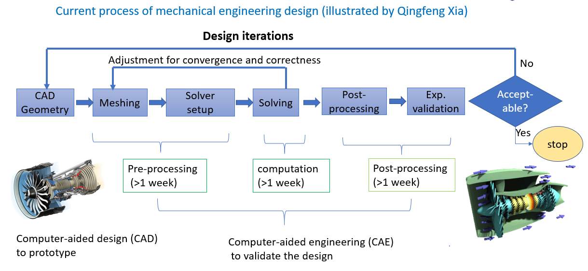
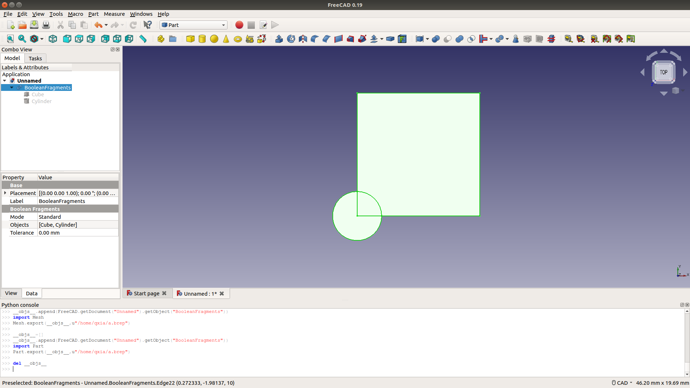
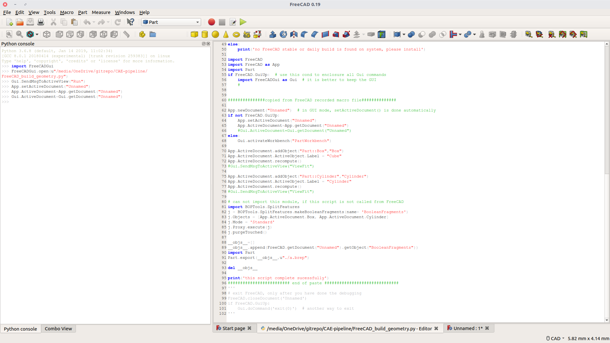

# Automate your engineering design and optimisation process using open source tools

by Qingfeng Xia

version 0.1 

2019-06-17 

<https://github.com/qingfengxia/CAE_pipeline>

## Philosophy

Why CAE pipeline/automation is needed? look at the current process of engineering design and optimization process.


However, it is common to have several design iterations. If the geometry topology changed, I need to repeat the process. There are lots of tedious repeating labour work.  From a programmer's perspective, there must be something wrong.  Nevertheless, if the design is complex of thousands of parts, manually fixing the  broken workflow is not practical. An automated working flow is essential to improve productivity.

## CAE pipeline

In the past 3 years, I have been working on automated physical simulation to accelerate my engineering design process. 


see also my presentation at Fenics 18: [Automated Mechanical Engineering Design using Open Source CAE Software Packages](https://github.com/qingfengxia/FenicsSolver/tree/master/doc/Fenics18_Xia.pdf)

### Related projects

Those are github projects I developed to enable automated CAE.

+ FreeCAD: **Module developer Guide to FreeCAD source**

- CFD <https://github.com/qingfengxia/Cfd>
- FenicsSolver <https://github.com/qingfengxia/FenicsSolver>

## Open source tools involved

+ [FreeCAD](https://www.freecadweb.org): geometry building and case setup for FEM and OpenFOAM CFD solver
+ [Gmsh](http://gmsh.info/): meshing and mesh format translation
+ [Salome platform](https://www.salome-platform.org/): geometry, meshing, FEM (Code_Aster) and CFD solver (Code_Saturne)
+ FEM solver such as [Fenics/dolfin](https://fenicsproject.org/)
+ CFD solver such as [OpenFOAM](https://www.openfoam.net/)
+  Multiple solver coupling: [PreCICE](https://www.precice.org/)
+ Post-processing: [ParaView](https://www.paraview.org/)

Those tools are selected mainly for their friendly python interfacing, esp, FreeCAD and Salome GUI can record operation into Python script. 


Some commercial tools can be used like Ansys Workbench, but there is cell number limit of 0.5 million for CFD and non-commercial usage restriction.


## Demonstration source code structure

+ `*_parameter.py`: parameter define the geomtrical parameters and topology

  This python file will be shared among all different tools, so it should be python2 and python3 compatible, keep as simple as possible with parameter and bool switches.

+ `*_goemetry.py`: generate geometry from FreeCAD

  This is a example geometry building script using FreeCAD.

+ `mesh_*.py`: meshing and grouping, esp for boundary layer

  The first part is to build the geomery (a section of labyrinth seal), alternatively, you can mport geometry file into Salome.  Be careful, CAD tools default to mm while meshing tool using metre, Salome platform may prompt you to let you select the length unit. This script also do meshing, group and name solids and boundary faces,  export.

+ `convert_mesh.sh`:  A  shell script for automatically meshing generation/conversion.

  meshing format conversion can be done here (*gmsh* is excellent  for mesh format coversion )

+ solver setup

  A template of solver setup file should be ready, referring to the predefined mesh file name, so mesh file can be updated automatically. As long as the boundary group names (as the unique ID of a group of boundary faces) are not changed, a new simulation can be done without interference.

+ run the solvers

   Tf there is multiple solvers in a coupling simulation, a bash script can start all solvers properly.
   
+ `*_plot.py`: read result and post_processing for 3D viz and 2D plot for reporting.

   2D in `matplotlib`, 3D using `paraview`,  you can record the GUI operation in python file (macro file) and adapt the python code for paraview-catalyst remote 

## Geometry building
+ 2D geometry from FreeCAD: create a close wire in sketcher workbench, keep this sketch selected, **create face from wire** in **Part** menu of the **Part workbench**. This face is a 2D geometry ready to be exported to meshing tools.

  

  

+ Building connected solids (only one face connecting two solid in contact) for a multi-solid part assembly,  is essential for CFD simulation. It can be achieved by **boolean fragments**

+ FreeCAD boolean fragments (part -> split -> fragments) , save compound shape into brep format.  Brep format file works without any further operation in Salome (which can also do boolean fragment, but harder in respect to user interface), while step file does not work straightly after import in Salome.

## Lessons learned on Salome meshing

  - if `parameter.py` file changed, salome must be restarted to get updating parameters to take effect. In the early development stage, the content of parameter.py should be copied into the salome meshing script. Therefore, single script can be editted, reloaded and tested quickly without restart Salome.
  - In Salome, "Volume group" must be defined for the mesh, otherwise, only surface mesh is exported (checking by load into gmsh GUI) by default to MED mesh format.
  - focus on GUI operation until the first perfect meshing is confirmed by CFD solver, then focus on script

## Mesh conversion

`meshio-convert` (from meshio python package) can translate the salome Med format into dolfin format, however, it seems boundary and subdomains are not converted. 

[MOAB — The Mesh-Oriented datABase](https://press3.mcs.anl.gov/sigma/moab-library/),  is the open source tool for meshing conversion. 

###  Tested new route for CFD solvers

Salome (export as *.med mesh file) -> gmsh (command line converting into gmsh native *.msh format) -> OpenFOAM (to foam mesh format then converting to Ansys Fluent *.msh format)


here is the example bash script to mesh for Ansys Fluent

```
# change geometry in parameter py file
# run FreeCAD_build_geometry.py if you build geometry and export CAD file using FreeCAD

# here abs path to salome and meshing script must be used! adapt path into your own
/opt/SALOME-8.5.0-UB16.04-SRC/salome -t  /media/sf_OneDrive/gitrepo/seal_design/salome_mesh_seal.py

# assuming gmsh4 is on your search path, I rename v4 as gmsh4 as I have other version 
gmsh4 -format msh2 -o /media/sf_OneDrive/cases/sealmesh/Mesh_p_3d.msh -save /tmp/Mesh_1.med

# copy a openfoam tutorial case into somewhere, and delete the mesh folder
# 
# gmshToFoam need a case file structure to work
cd /media/sf_OneDrive/cases/sealmesh/
# assuming you have source openfoam bashrc into your ~/.bashrc
gmshToFoam Mesh_p_3d.msh
foamMeshToFluent
mv  fluentInterface/sealmesh.msh  ../fluentCFD/Mesh_p_5deg_3D.msh

# in Ansys workbench, you can `replace mesh` in GUI to reuse the previous case setup
# for other solver, it may be possible to run the solver without launch GUI
```


#### Notes on Ansys Fluent Solver

*replace mesh* while keep case setup in Fluent. 
`Replace Mesh...` in the Setting Up `Domain` ribbon tab `Zones` group box, or `Mesh -> Replace ...` menu

Note that the data interpolation is done automatically during the replacement if data exists

There should be CLI command for mesh replacement, it may be useful in remote HPC.

- CFD solver is very sensitive to mesh quality, quad and hex mesh is preferred.
- Compressible flow is very sensitive to initial condition

### For FEA solvers

Some fem solvers just accept UNV format (I-DEAS) export from Salome.

Salome (export as *.med mesh file) -> gmsh (command line converting into gmsh native msh format) -> `dolfin-convert` converting into FEniCS xml mesh format.


## Advanced usage of Paraview 

todo!

## User cases

link to example case repo: <https://github.com/qingfengxia/quasi_static_metal_cut>


## License

This work derived from my independent research during my stay in Oxford University, using most of my after-work time.  A very loose license (MIT) should be adopted, to let user to adapt this code by broadest users. 

Do refer to our paper and presentation. [paper link]()

